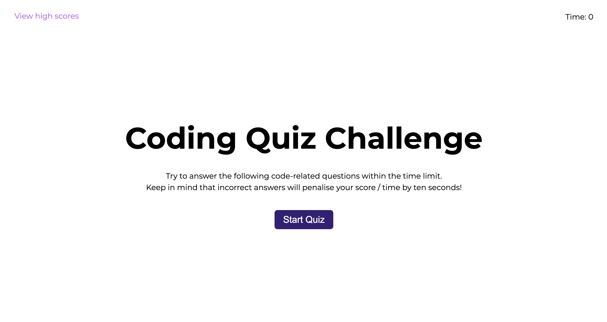
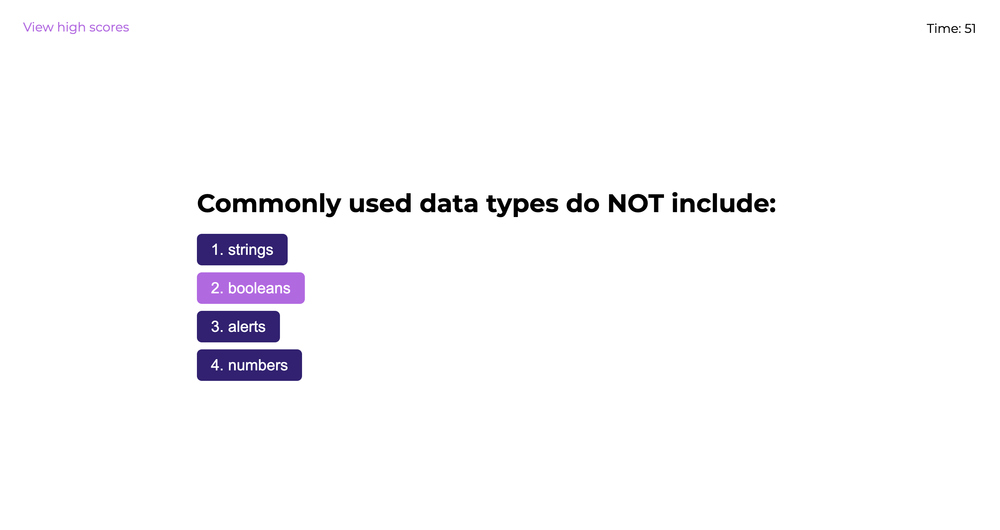

# Javascript Quiz

## Description
A timed quiz to test the user's JavaScript knowledge. The user gets 60 seconds to complete five multiple-choice questions. Each time an incorrect answer is given, the timer drops 10 seconds. The final user score is the time remaining at the end of the quiz. Once the quiz is complete, the user can submit their score to a 'high scores' board to see their result relative to previous attempts. The high scores are stored in local storage and can be cleared by the user if required.

## Website Link
[Link to quiz](https://katyjmt.github.io/javascript-quiz/)

## Screenshot

## License
MIT License

Copyright (c) 2023 Katy Thompson

Permission is hereby granted, free of charge, to any person obtaining a copy of this software and associated documentation files (the "Software"), to deal in the Software without restriction, including without limitation the rights to use, copy, modify, merge, publish, distribute, sublicense, and/or sell copies of the Software, and to permit persons to whom the Software is furnished to do so, subject to the following conditions:

The above copyright notice and this permission notice shall be included in all copies or substantial portions of the Software.

THE SOFTWARE IS PROVIDED "AS IS", WITHOUT WARRANTY OF ANY KIND, EXPRESS OR IMPLIED, INCLUDING BUT NOT LIMITED TO THE WARRANTIES OF MERCHANTABILITY, FITNESS FOR A PARTICULAR PURPOSE AND NONINFRINGEMENT. IN NO EVENT SHALL THE AUTHORS OR COPYRIGHT HOLDERS BE LIABLE FOR ANY CLAIM, DAMAGES OR OTHER LIABILITY, WHETHER IN AN ACTION OF CONTRACT, TORT OR OTHERWISE, ARISING FROM, OUT OF OR IN CONNECTION WITH THE SOFTWARE OR THE USE OR OTHER DEALINGS IN THE SOFTWARE.

